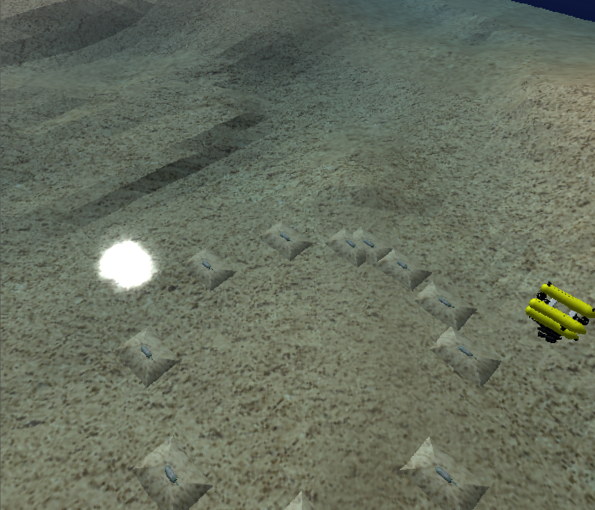
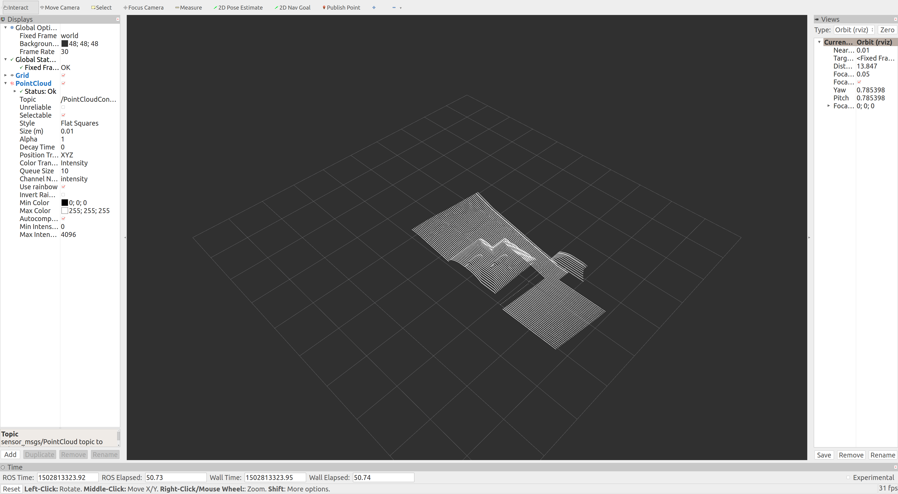

# Underwater_SLAM	

A ROS package to accomplish algorithm related to SLAM, based on [UWSim](http://www.irs.uji.es/uwsim/).

## Getting Started

Some basic instructions.

Launch UWSim node.

```shell
rosrun uwsim uwsim --configfile ~/catkin_ws/src/UnderwaterSlam/config/dredging.xml 
```

{ width: 200px; }

## Files Organization

**config**

configure files used for UWSim.

**src**

source files 

**srv**

ROS service files


## ROS Topic 

**/dataNavigator** 

Message to navigate the ship.

**/g500/dvl**

DVL message for ship.

**/g500/imu**

IMU message for ship.

**/PointCloudConveyNow**

Point cloud generated by ship.


## ROS Services

**PointDetection** 

Get point cloud which contains only key points.

**RequireControl**

Get quaternion and linear velocity for ship.


## ROS Node 

**laser_convey_now**

Generate point cloud for ship.

{ width: 200px; }

**save_pcl**

Save point cloud to local files.

**process**

Main loop for SLAM.